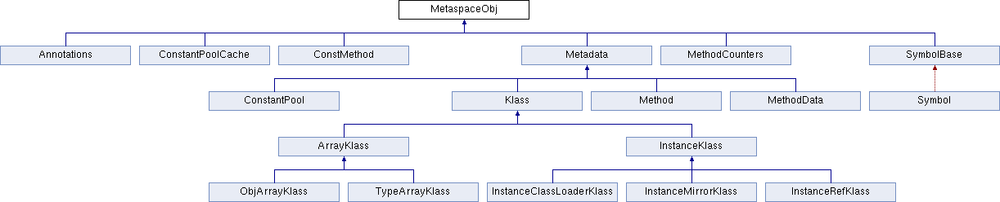
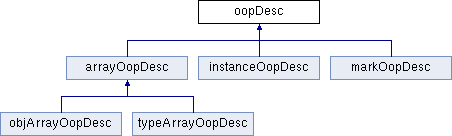
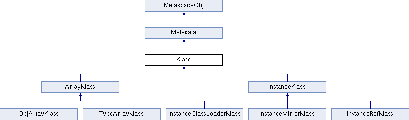

# OpenJDK HotSpot RTFSC

## 项目结构

- [jdk8u252-b08](https://github.com/AdoptOpenJDK/openjdk-jdk8u)

```
├── cpu
├── os
├── os_cpu
└── share
    ├── tools
    └── vm
        ├── adlc                        // Architecture Description Language Compiler
        ├── asm                         // platform-independent assembler
        ├── c1                          // C1 Compiler
        ├── ci                          // 动态编译器???
        ├── classfile                   // 类加载器和类文件
        ├── code                        // 机器码生成???
        ├── compiler                    // 调用动态编译器的接口???
        ├── gc_implementation           // GC实现
        │   ├── concurrentMarkSweep
        │   ├── g1
        │   ├── parNew
        │   ├── parallelScavenge
        │   └── shared
        ├── gc_interface                // GC接口
        ├── interpreter                 // 解释器
        ├── libadt                      // 抽象数据结构
        ├── memory                      // 内存管理
        ├── oops                        // VM内部对象表示
        ├── opto                        // C2 Compiler
        ├── precompiled
        ├── prims                       // 对外接口???
        ├── runtime                     // 运行时
        ├── services                    // Serviceability
        ├── shark                       // LLVM based Compiler
        ├── trace
        └── utilities
```

## Convensions in Codes

```
allocation.hpp

// All classes in the virtual machine must be subclassed
// by one of the following allocation classes:
//
// For objects allocated in the resource area (see resourceArea.hpp).
// - ResourceObj
//
// For objects allocated in the C-heap (managed by: free & malloc).
// - CHeapObj
//
// For objects allocated on the stack.
// - StackObj
//
// For embedded objects.
// - ValueObj
//
// For classes used as name spaces.
// - AllStatic
//
// For classes in Metaspace (class data)
// - MetaspaceObj
//
```

- MetaspaceObj



## VM Internal Representation of Java Classes and Objects

- oop: Ordinary Object Pointer



- Klass




|抽象|说明|补充|
|:----|:----|:----|
| annotations | 注解 | |
| compiledICHolder |  | |
| constMethod | Java方法中不变的部分. | 头文件中有内存布局的说明. |
| constantPool | `ConstantPool`: 类文件中描述的类常量的数组. | |
| cpCache | `ConstantPoolCache`: 伴随常量池的运行时数据结构, 持有访问字段和调用字节码的解释器运行时信息. | |
| generateOopMap | 计算方法中指针映射??? | |
| symbol | `Symbol`: 类文件中符号表中的符号, 被引用计数. | |
| klass | `Klass`: 提供了 (1) 语言层次的类对象(方法字典等), (2) 提供了对象上的VM分发行为. | 头文件中有布局的说明. |
| instanceKlass | `InstanceKlass`: Java类的VM层级表示, 包含了执行运行时所需的信息.  | 头文件中有布局的说明.|
| instanceOop | Java类的一个实例.  | |
| instanceClassLoaderKlass | `InstanceClassLoaderKlass` | |
| instanceMirrorKlass | `InstanceMirrorKlass`: 用于Java的`java.lang.Class`的特殊`InstanceKlass`. | |
| instanceRefKlass | Java `java.lang.ref.Reference`的子类的特殊 | |
| arrayKlass | `ArrayKlass`: 数组类型的抽象基类 | |
| arrayOop | `arrayOopDesc`: 数组OOP | 头文件中有布局的说明. |
| objArrayKlass | `ObjArrayKlass`: objArray的klass. |  |
| objArrayOop | `objArrayOopDesc`: 元素为OOP的数组objArray. | |
| typeArrayKlass | `TypeArrayKlass`: typeArray的klass, 包含元素的类型和大小. | |
| typeArrayOop | `typeArrayOopDesc`: 元素为基本类型(非OOP)的数组typeArray. | |
| klassVtable | `klassVtable`: `InstanceKlass`和`ArrayKlass`中变长vtable的抽象. <br> `klassItable`: Java接口相关的vtable. | |
| oop | `oopDesc`: OOP抽象基类 | |
| oopsHierarchy | (1) 表示性的对象层次: `oop`, `instanceOop`, `arrayOop`, `objArrayOop`, `typeArrayOop`. <br> (2) metadata层次: `MetaspaceObj`, `Metadata`, `CHeapObj` (3) klass层次: `InstanceKlass`, `ArrayKlass` | |
| markOop | `markOopDesc`: 对象头的抽象. | 头文件中有对象头的位格式说明. |
| metadata | `Metadata`: 内部类相关的元数据. | |
| method | `Method`: Java方法的抽象. | 头文件中有内存布局的说明. |
| methodCounters |  | |
| methodData | `MethodData`: 收集解释和执行时的计数器和其它度量信息, 用于后续的启发式编译.  | |
